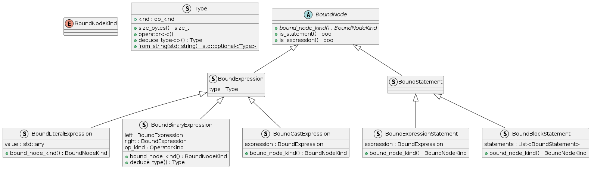

# AAAAAAAAAA
- source code or REPL -> tree-sitter ast -> [anotated ast](../src/include/binding/binder.hpp) -> interpret it -> PROFIT??

#### Probably outdated class diagram of binding

#### TODO's in order
- division by zero
- even more tests!
- variable creation, assignment expression
- pointers?
- control flow, if, while, for..  (goto ??)
- functions
- script vs main()
- ... ???

